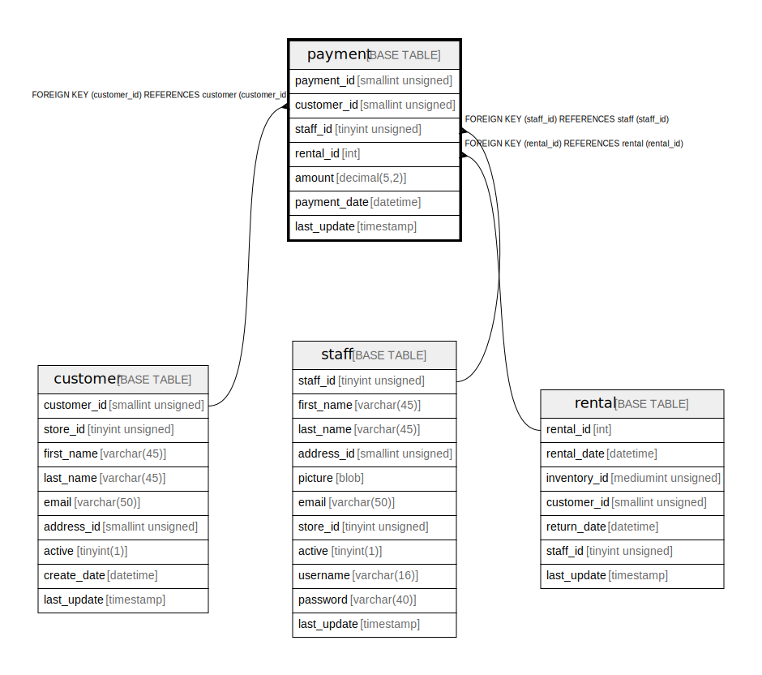

# payment

## Description

<details>
<summary><strong>Table Definition</strong></summary>

```sql
CREATE TABLE `payment` (
  `payment_id` smallint unsigned NOT NULL AUTO_INCREMENT,
  `customer_id` smallint unsigned NOT NULL,
  `staff_id` tinyint unsigned NOT NULL,
  `rental_id` int DEFAULT NULL,
  `amount` decimal(5,2) NOT NULL,
  `payment_date` datetime NOT NULL,
  `last_update` timestamp NULL DEFAULT CURRENT_TIMESTAMP ON UPDATE CURRENT_TIMESTAMP,
  PRIMARY KEY (`payment_id`),
  KEY `idx_fk_staff_id` (`staff_id`),
  KEY `idx_fk_customer_id` (`customer_id`),
  KEY `fk_payment_rental` (`rental_id`),
  CONSTRAINT `fk_payment_customer` FOREIGN KEY (`customer_id`) REFERENCES `customer` (`customer_id`) ON DELETE RESTRICT ON UPDATE CASCADE,
  CONSTRAINT `fk_payment_rental` FOREIGN KEY (`rental_id`) REFERENCES `rental` (`rental_id`) ON DELETE SET NULL ON UPDATE CASCADE,
  CONSTRAINT `fk_payment_staff` FOREIGN KEY (`staff_id`) REFERENCES `staff` (`staff_id`) ON DELETE RESTRICT ON UPDATE CASCADE
) ENGINE=InnoDB AUTO_INCREMENT=[Redacted by tbls] DEFAULT CHARSET=utf8mb4 COLLATE=utf8mb4_0900_ai_ci
```

</details>

## Columns

| Name | Type | Default | Nullable | Extra Definition | Children | Parents | Comment |
| ---- | ---- | ------- | -------- | ---------------- | -------- | ------- | ------- |
| payment_id | smallint unsigned |  | false | auto_increment |  |  |  |
| customer_id | smallint unsigned |  | false |  |  | [customer](customer.md) |  |
| staff_id | tinyint unsigned |  | false |  |  | [staff](staff.md) |  |
| rental_id | int |  | true |  |  | [rental](rental.md) |  |
| amount | decimal(5,2) |  | false |  |  |  |  |
| payment_date | datetime |  | false |  |  |  |  |
| last_update | timestamp | CURRENT_TIMESTAMP | true | DEFAULT_GENERATED on update CURRENT_TIMESTAMP |  |  |  |

## Constraints

| Name | Type | Definition |
| ---- | ---- | ---------- |
| fk_payment_customer | FOREIGN KEY | FOREIGN KEY (customer_id) REFERENCES customer (customer_id) |
| fk_payment_rental | FOREIGN KEY | FOREIGN KEY (rental_id) REFERENCES rental (rental_id) |
| fk_payment_staff | FOREIGN KEY | FOREIGN KEY (staff_id) REFERENCES staff (staff_id) |
| PRIMARY | PRIMARY KEY | PRIMARY KEY (payment_id) |

## Indexes

| Name | Definition |
| ---- | ---------- |
| fk_payment_rental | KEY fk_payment_rental (rental_id) USING BTREE |
| idx_fk_customer_id | KEY idx_fk_customer_id (customer_id) USING BTREE |
| idx_fk_staff_id | KEY idx_fk_staff_id (staff_id) USING BTREE |
| PRIMARY | PRIMARY KEY (payment_id) USING BTREE |

## Triggers

| Name | Definition |
| ---- | ---------- |
| payment_date | CREATE TRIGGER payment_date BEFORE INSERT ON payment<br>FOR EACH ROW<br>SET NEW.payment_date = NOW() |

## Relations



---

> Generated by [tbls](https://github.com/k1LoW/tbls)
