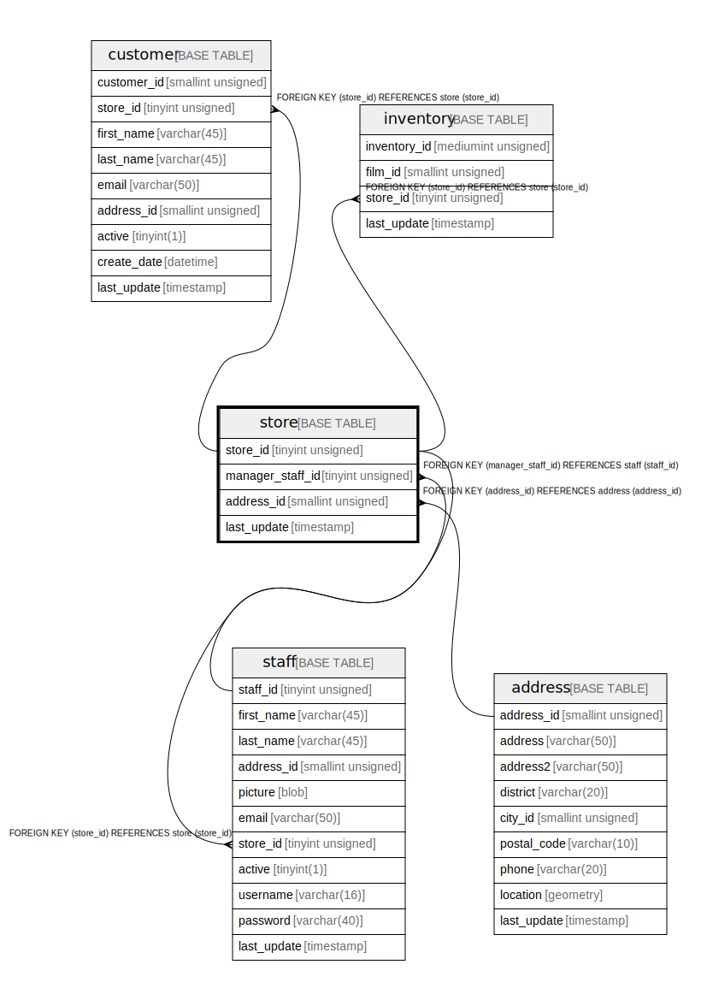

# store

## Description

<details>
<summary><strong>Table Definition</strong></summary>

```sql
CREATE TABLE `store` (
  `store_id` tinyint unsigned NOT NULL AUTO_INCREMENT,
  `manager_staff_id` tinyint unsigned NOT NULL,
  `address_id` smallint unsigned NOT NULL,
  `last_update` timestamp NOT NULL DEFAULT CURRENT_TIMESTAMP ON UPDATE CURRENT_TIMESTAMP,
  PRIMARY KEY (`store_id`),
  UNIQUE KEY `idx_unique_manager` (`manager_staff_id`),
  KEY `idx_fk_address_id` (`address_id`),
  CONSTRAINT `fk_store_address` FOREIGN KEY (`address_id`) REFERENCES `address` (`address_id`) ON DELETE RESTRICT ON UPDATE CASCADE,
  CONSTRAINT `fk_store_staff` FOREIGN KEY (`manager_staff_id`) REFERENCES `staff` (`staff_id`) ON DELETE RESTRICT ON UPDATE CASCADE
) ENGINE=InnoDB AUTO_INCREMENT=[Redacted by tbls] DEFAULT CHARSET=utf8mb4 COLLATE=utf8mb4_0900_ai_ci
```

</details>

## Columns

| Name | Type | Default | Nullable | Extra Definition | Children | Parents | Comment |
| ---- | ---- | ------- | -------- | ---------------- | -------- | ------- | ------- |
| store_id | tinyint unsigned |  | false | auto_increment | [customer](customer.md) [inventory](inventory.md) [staff](staff.md) |  |  |
| manager_staff_id | tinyint unsigned |  | false |  |  | [staff](staff.md) |  |
| address_id | smallint unsigned |  | false |  |  | [address](address.md) |  |
| last_update | timestamp | CURRENT_TIMESTAMP | false | DEFAULT_GENERATED on update CURRENT_TIMESTAMP |  |  |  |

## Constraints

| Name | Type | Definition |
| ---- | ---- | ---------- |
| fk_store_address | FOREIGN KEY | FOREIGN KEY (address_id) REFERENCES address (address_id) |
| fk_store_staff | FOREIGN KEY | FOREIGN KEY (manager_staff_id) REFERENCES staff (staff_id) |
| idx_unique_manager | UNIQUE | UNIQUE KEY idx_unique_manager (manager_staff_id) |
| PRIMARY | PRIMARY KEY | PRIMARY KEY (store_id) |

## Indexes

| Name | Definition |
| ---- | ---------- |
| idx_fk_address_id | KEY idx_fk_address_id (address_id) USING BTREE |
| PRIMARY | PRIMARY KEY (store_id) USING BTREE |
| idx_unique_manager | UNIQUE KEY idx_unique_manager (manager_staff_id) USING BTREE |

## Relations



---

> Generated by [tbls](https://github.com/k1LoW/tbls)
